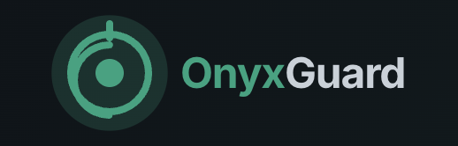

# OnyxGuard: Advanced Ethereum Security Analysis - frontend

OnyxGuard is a security-focused Ethereum analysis platform that allows users to analyze wallet addresses for potential security risks and vulnerabilities.



## Overview

The OnyxGuard frontend application enables users to:

- Connect their MetaMask wallet directly or enter an Ethereum wallet address manually
- Receive comprehensive security analysis with risk scoring
- View detailed security alerts categorized by risk level (High, Medium, Low)
- Monitor potential threats to their Ethereum assets
- Access source-verified risk intelligence

## Features

- **MetaMask Integration**: Connect your wallet with one click
- **Risk Dashboard**: Visual overview of security status and risk assessments
- **Security Alerts**: Detailed analysis of potential risks categorized by severity
- **Source Verification**: All alerts include verified sources to validate findings
- **Privacy-Focused**: Built with privacy in mind using Oasis Sapphire technology

## Getting Started

### Prerequisites

- Node.js (v16 or later)
- npm or yarn
- A modern web browser with MetaMask extension installed (optional, but recommended)

### Installation

1. Clone the repository:
   ```
   git clone https://github.com/your-repo/onyxguard-frontend.git
   cd onyxguard-frontend
   ```

2. Install dependencies:
   ```
   npm install
   ```

3. Start the development server:
   ```
   npm run dev
   ```

4. Open the provided localhost URL in your browser (preferably one with MetaMask extension installed)

5. You can now:
   - Connect directly with MetaMask
   - Or enter an Ethereum wallet address in the search bar

6. Explore the dashboard and security alerts for the analyzed wallet

## Application Structure

- **Landing Page**: Entry point with wallet connection options
- **Dashboard**: Overview of security risks for the analyzed wallet
- **Alerts**: Detailed view of all security notifications with filtering options
- **MetaMask Integration**: Connect and analyze your own wallet with one click

## Technical Stack

- **React + TypeScript**: For robust frontend development
- **Framer Motion**: For smooth animations and transitions
- **Tailwind CSS**: For responsive and modern UI design
- **MetaMask Integration**: For direct wallet connections
- **Context API**: For state management across components

## Backend Integration

The frontend connects to a backend API service that:
- Analyzes wallet addresses
- Returns security notifications with risk scoring
- Provides source verification for all identified issues

Default API endpoint is configured to `http://localhost:8003` which can be modified in `src/services/api.ts`.

## Key Components

- **WalletInputForm**: Handles wallet address input and validation
- **MetaMaskConnect**: Manages wallet connections via MetaMask
- **NotificationCard**: Displays security alert information
- **RiskBadge**: Visual indicator of risk levels
- **Dashboard & Alerts**: Main views for security information

## Development Notes

- The application uses React Router for navigation
- Context API is used for notification state management
- MetaMask integration is handled via the `useWalletConnect` hook
- Security alerts include priority scoring, risk levels, and verified sources